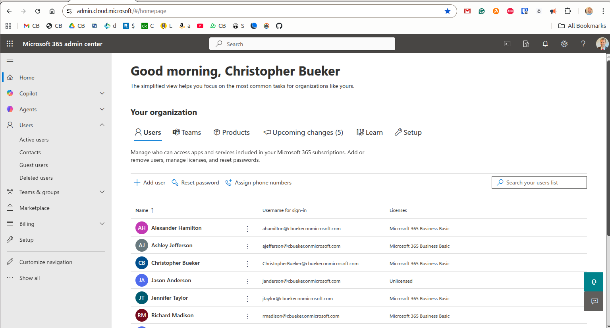
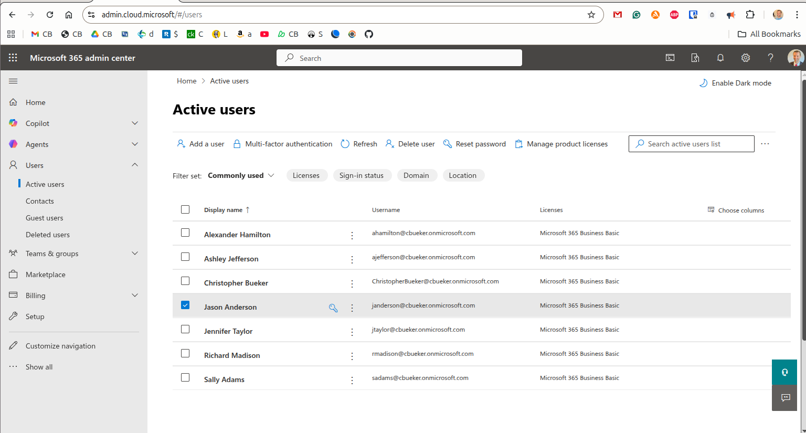
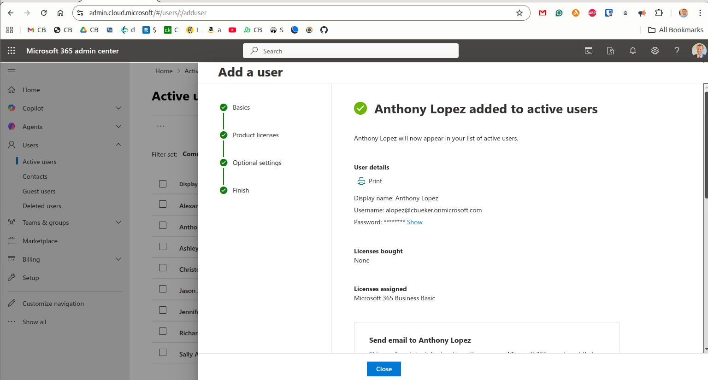
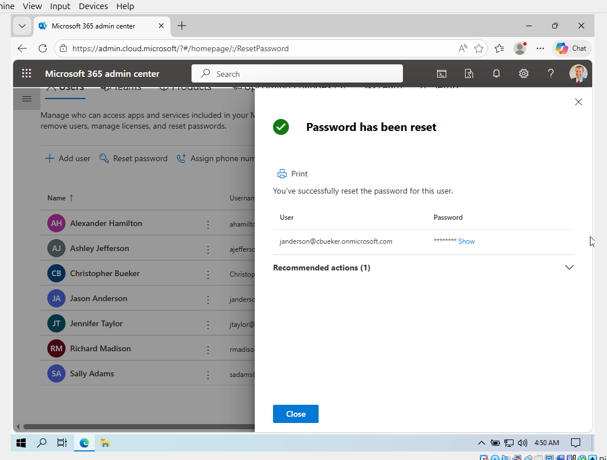
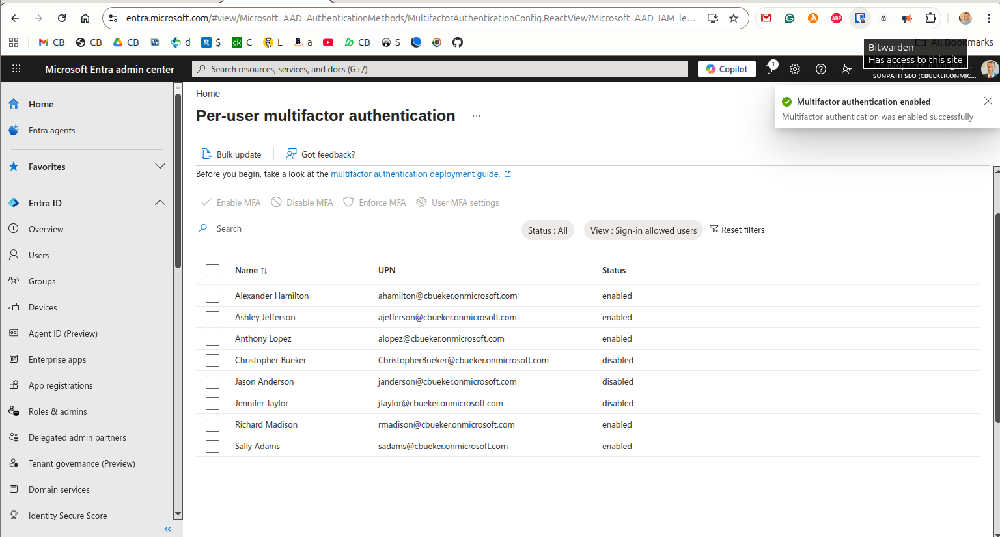
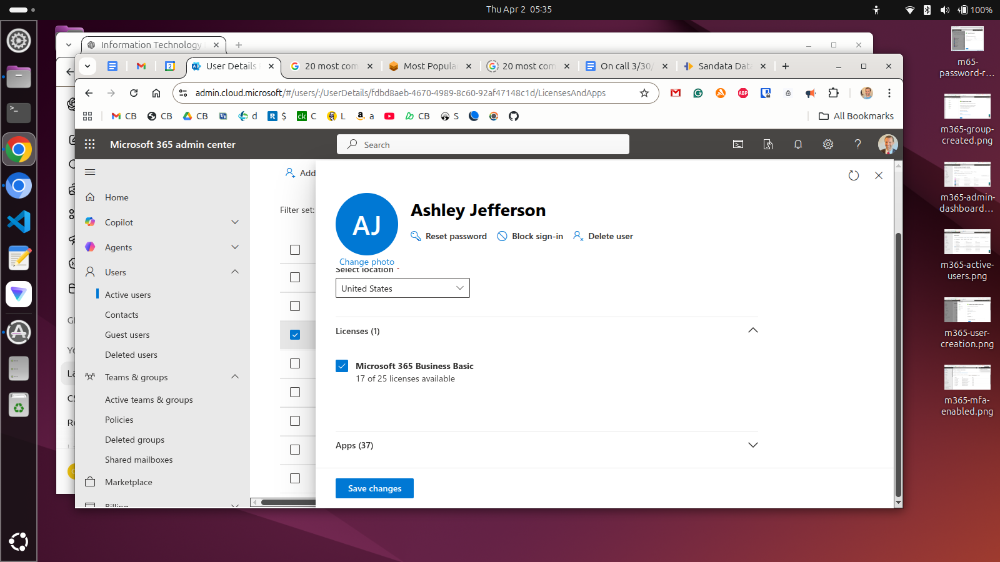
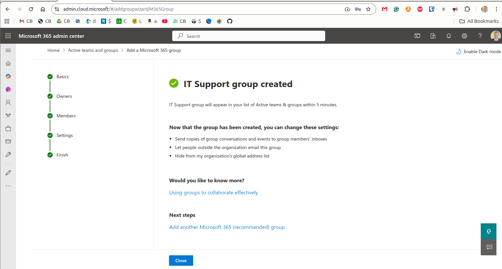
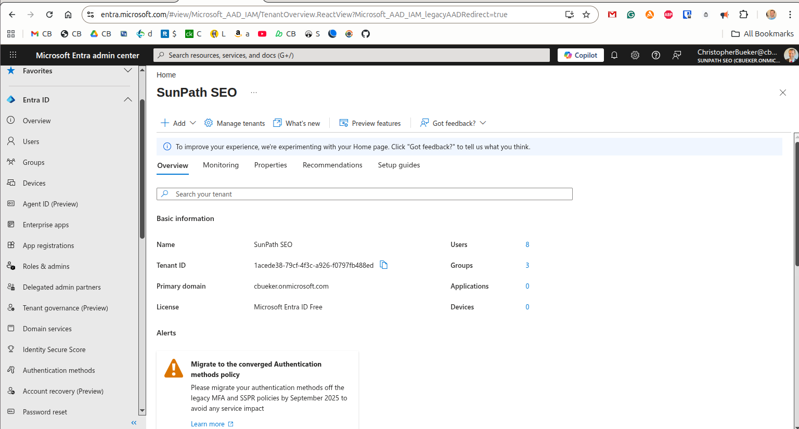

**Microsoft 365 Admin Center Lab**

I built this hands-on Microsoft 365 lab to practice cloud-based user administration, license management, password resets, multifactor authentication, group creation, and Microsoft Entra identity review. This shows how cloud administration tasks connect across the Microsoft 365 Admin Center and the Microsoft Entra admin center.

Lab Objectives
- Access Microsoft 365 Admin Center and Microsoft Entra admin center
- Review tenant dashboard and active user administration
- Create a new cloud user and assign licensing
- Reset a user password
- Enable multifactor authentication
- Review license assignment and available subscriptions
- Create a Microsoft 365 group
- Review Microsoft Entra tenant overview

Microsoft 365 Admin Center Dashboard

I accessed the Microsoft 365 Admin Center and reviewed the main administration dashboard. This shows the starting point for cloud user, group, and service administration.

Active Users Administration

I reviewed active users inside the tenant and confirmed usernames and assigned licenses. This shows cloud identity visibility and day-to-day user administration.

User Creation

I created a new cloud user and completed the provisioning workflow with license assignment. This shows cloud account creation inside Microsoft 365 Admin Center.

Password Reset

I reset a user password and confirmed successful completion inside the admin interface. This shows a common support task performed in cloud identity administration.

Multifactor Authentication

I enabled multifactor authentication for selected users through Microsoft Entra authentication settings. This shows basic identity security administration in a cloud environment.

License Assignment

I reviewed license assignment for an active user and confirmed Microsoft 365 Business Basic allocation. This shows how cloud services are attached to user accounts through licensing.

Group Creation

I created an IT Support Microsoft 365 group to organize collaboration and membership. This shows cloud group administration for shared access and communication.

Microsoft Entra Overview

I reviewed tenant information inside Microsoft Entra admin center, including users, groups, and tenant identity details. This shows the identity platform that supports Microsoft 365 administration.

Skills Practiced
- Microsoft 365 Admin Center navigation
- Cloud user administration
- Password reset workflow
- Multifactor authentication basics
- License assignment
- Microsoft 365 group creation
- Microsoft Entra tenant review
- Cloud identity administration

Summary

This lab demonstrates practical Microsoft 365 administration in a cloud environment. It shows how identity, licensing, user support, and security tasks connect in entry-level cloud and systems administration work.

Navigation

[`Back to GitHub Profile`](https://www.github.com/cbueker-it)
